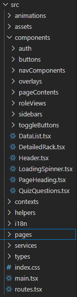

**Projektstruktur** 

Da es sich bei diesem Projekt nur um ein internes Projekt handelt, ist die Backend-Datei nicht besonders groß. Mehr oder weniger ist dort alles selbsterklärend, da die Kommunikation zwischen Datenbank und Frontend hauptsächlich über die Backend Queries erfolgt.

Ich wollte jedoch die Frontend Seite des Projekts gut strukturieren und die Dateien ordentlich benennen und platzieren, damit der gesamte Frontend Code später einfacher nachzuvollziehen ist. Dafür habe ich separate Ordner erstellt.

Im Ordner **animations** befinden sich die GSAP-Animationen, während in Assets die verwendeten Bilder gespeichert sind. Der Ordner **components** enthält wiederum mehrere Unterordner. In **auth** befinden sich die Login Seite und die Authentifizierungslogik. Unter **buttons** befinden sich allgemeine Button Komponenten, die über Props angepasst werden können.

Im Ordner **navComponents** befinden sich alle Komponenten, die für die Navigations-Sidebars verwendet werden. Unter **overlays** befinden sich die allgemeine Lösch-Overlay (DeleteOverlay.tsx) und die allgemeine Hinzufügen-Overlay (AddOverlay.tsx). Außerdem befinden sich dort die Komponenten, die die entsprechenden Parameter für die jeweilige Seite an die allgemeine Hinzufügen-Overlay übergeben, zum Beispiel AddCustomerOverlay.tsx, AddDeviceOverlay.tsx usw. Zusätzlich gibt es dort die Overlay zum Aktivieren von Fragen auf der Trainer-Seite (ActivateQuestionOverlay.tsx) und zum Beantworten der Fragen auf der Trainee-Seite (AnswerQuestionOverlay.tsx).

Im Ordner **pageContents** befinden sich die wichtigsten Inhalte der einzelnen Seiten. Unter **roleViews** werden die unterschiedlichen Komponenten für Trainer und Trainee gespeichert und anschließend entsprechend gerendert. Im Ordner **sidebars** befinden sich die beiden Sidebar Versionen für Mobile und Desktop.

Unter **toggleButtons** befinden sich die beiden Toggle Buttons für die Sprache und den Dark Mode. Danach kommen noch einzelne Komponenten, die keinem dieser Bereiche zugeordnet sind. Dazu gehören zunächst die allgemeine DataList.tsx für die einzelnen Seiten, die DetailedRack.tsx Komponente als visuelle Darstellung eines detaillierten Racks, der Header.tsx, der LoadingSpinner.tsx, der während des Ladens angezeigt wird, und die allgemeine PageHeading.tsx Komponente für die einzelnen Seiten.

Zum Schluss gibt es noch QuizQuestions.tsx, wo die Logik für das Rendern der Fragen auf der Trainer und Trainee Seite enthalten ist.

Im Ordner **context** befinden sich die Contexts für die Authentifizierung und den Dark Mode. Unter **helpers** befinden sich die verschiedenen Funktionen und Custom Hooks für die Datenauswahl und das Löschen. Dort befindet sich auch transformData.ts, mit der die aus der Datenbank ausgewählten Daten verändert werden können.

Der Ordner **i18n** ist für die Zweisprachigkeit zuständig. Dort befinden sich zwei JSON-Dateien für die deutsche und englische Sprache sowie die config.ts für die Sprachkonfiguration.

Im Ordner **pages** befinden sich alle einzelnen Seiten der Anwendung. Diese werden über die routes.tsx gerendert. Die Pages sind sozusagen die Eltern der verschiedenen Komponenten.

Unter **services** befindet sich die einzige Datei api.ts, in der die gesamte Kommunikation mit dem Backend ausgeführt wird. Zum Schluss gibt es noch den Ordner **types**, in dem die TypeScript-Typen gespeichert sind.

Ich denke, dass diese Aufteilung und Hierarchie sehr hilfreich ist, um Bugs früher zu erkennen und auch neuen Entwicklern, die später an dem Projekt arbeiten werden, die gesamte Code Struktur verständlicher zu machen. Auf den ersten Blick sieht die Struktur vielleicht etwas umfangreich aus, aber wenn man genauer hineinschaut, ist sie gar nicht so schwer nachzuvollziehen. Genau das sehe ich als einen großen Vorteil einer solchen Hierarchie.

Auch persönlich finde ich die einzelnen Dateien auf diese Weise viel schneller, als wenn ich entweder weniger Komponenten hätte oder genauso viele Komponenten in deutlich weniger Ordnern aufgeteilt wären.

**Project Structure**

Since this project is only an internal project, the backend file is not particularly large. More or less, everything there is self-explanatory, as the communication between the database and the frontend mainly takes place through the backend queries.

However, I wanted to structure the frontend side of the project well and name and organize the files properly so that the entire frontend code would be easier to understand later on. For this purpose, I created separate folders.

The **animations** folder contains the GSAP animations, while the images used in the project are stored in **assets**. The **components** folder contains several subfolders. The **auth** folder contains the login page and the authentication logic. The **buttons** folder contains general button components that can be customized using props.

The **navComponents** folder contains all components used for the navigation sidebars. The **overlays** folder contains the general delete overlay (**DeleteOverlay.tsx**) and the general add overlay (**AddOverlay.tsx**). It also contains the components that pass the respective parameters for each page to the general add overlay, such as **AddCustomerOverlay.tsx**, **AddDeviceOverlay.tsx**, etc. Additionally, this folder contains the overlay for activating questions on the trainer page (**ActivateQuestionOverlay.tsx**) and the overlay for answering questions on the trainee page (**AnswerQuestionOverlay.tsx**).

The **pageContents** folder contains the main content of the individual pages. Under **roleViews**, the different components for trainers and trainees are stored and then rendered accordingly. The **sidebars** folder contains the two sidebar versions for mobile and desktop.

The **toggleButtons** folder contains the two toggle buttons for the language and dark mode. There are also several individual components that do not belong to any of these categories. These include the general **DataList.tsx** for the individual pages, the **DetailedRack.tsx** component as a visual representation of a detailed rack, **Header.tsx**, **LoadingSpinner.tsx**, which is displayed while the application is loading, and the general **PageHeading.tsx** component used for the individual pages.

Finally, there is **QuizQuestions.tsx**, which contains the logic for rendering the questions on both the trainer and trainee pages.

The **context** folder contains the contexts for authentication and dark mode. The **helpers** folder contains various functions and custom hooks for selecting and deleting data. It also contains **transformData.ts**, which can be used to modify the data retrieved from the database.

The **i18n** folder is responsible for the application's bilingual functionality. It contains two JSON files for the German and English languages, as well as **config.ts** for the language configuration.

The **pages** folder contains all the individual pages of the application. These are rendered through **routes.tsx**. The pages can essentially be seen as the parents of the different components.

The **services** folder contains the only file, **api.ts**, which handles all communication with the backend. Finally, there is the **types** folder, where the TypeScript types are stored.

I think that this organization and hierarchy are very helpful for identifying bugs earlier and also for making the overall code structure easier to understand for new developers who may work on the project in the future. At first glance, the structure may seem somewhat extensive, but when looking at it more closely, it is actually not that difficult to understand. I see this as one of the major advantages of such a hierarchy.

Personally, I also find the individual files much faster to locate this way than if I either had fewer components or had the same number of components distributed across significantly fewer folders.
